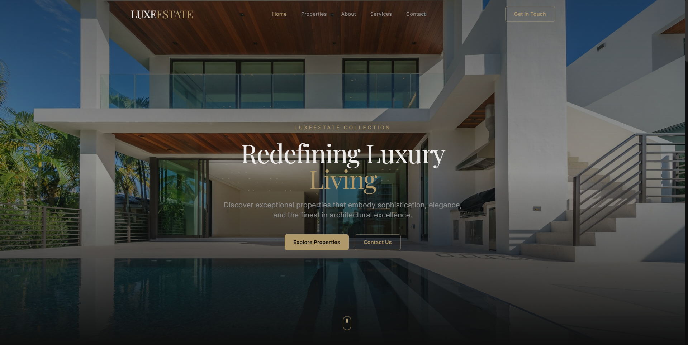

<p align="center">
  
</p>

<h1 align="center">LuxeEstate</h1>

<p align="center">
  <strong>Luxury Real Estate Website</strong><br/>
  Built with React & Vite • Designed with a Dark Premium Aesthetic
</p>

<p align="center">
  Modern • Elegant • Responsive • Performance-Focused
</p>

---

## ✨ Overview

LuxeEstate is a high-end real estate web experience built with a focus on:

- Elegant dark UI design  
- Subtle, refined motion  
- Clean component architecture  
- Premium visual hierarchy  
- Smooth navigation and page transitions  

The project reflects real-world frontend structure and maintainability practices.

---

## 🛠 Tech Stack

- **React**
- **Vite**
- **TypeScript**
- **Tailwind CSS**
- **Framer Motion**

---

## 🎨 Design Philosophy

LuxeEstate follows a **“quiet luxury”** design approach:

- Animations are felt, not noticed  
- Clear and confident typography  
- Spacious layouts  
- Minimal but powerful interactions  
- Focus on trust and refinement  

---

## 📁 Project Structure

```txt
src/
  components/
    common/
    layout/
    navigation/
    property/
    marketing/
  pages/
  hooks/
  utils/
  constants/
  styles/
```

---

## 🚀 Getting Started

Installation

```sh
git clone https://github.com/Samyak26K/luxeestate.git
cd luxeestate
npm install
```
Run Development Server

```sh
npm run dev
```

The application will start on the local development port shown in the terminal.

---

## 🌟 Key Features

Fully responsive layout

Smooth page transitions

Centralized animation system

Reusable component design

Scroll-to-top navigation handling

Premium CTA hierarchy

---

📌 Development Notes

Initial scaffolding was tool-assisted

The project has been fully refactored and structured manually

Architecture reflects real-world frontend engineering practices

---

👤 Author

Samyak K.

---

<p align="center"> Crafted with attention to detail and modern frontend standards ✨ </p> 
